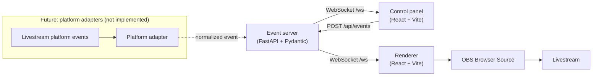

<p align="center">
  
</p>

<p align="center">
  <a href="https://github.com/quangshuynh/livescape/actions/workflows/ci.yml"></a>
  <a href="LICENSE"></a>
  
  
  
  
  
</p>


# LiveScape

Local-first interactive scene engine for livestreams: a renderer that draws a
dynamic environment around a live camera feed and reacts to events in real
time, designed to be dropped into OBS as a Browser Source. Your camera is
separated from your physical background on your own machine; frames never leave
the renderer.

## What problem it solves

Stream overlays are usually either static images or a pile of platform-specific
scripts glued to one service's API. LiveScape separates the two halves:

* a **renderer** that knows how to draw scenes and effects, and nothing else;
* an **event protocol** that any source can speak, whether that is an operator
  pressing a button today or a platform adapter tomorrow.

The renderer has no idea what TikTok is, and never will. Platform adapters
translate external events into normalized LiveScape events; everything below
that boundary stays the same.

## Current status

LiveScape provides a working local event pipeline, from the operator control
panel through the FastAPI event server to the renderer:

```
control panel → FastAPI event server → WebSocket → renderer → visible change
```

What exists and is verified:

* four scenes (City, Forest, Space and Roadside Workshop) and three effects
  (rain, snow, fireworks), drawn with CSS, SVG and Canvas, using no third-party
  artwork and no external assets;
* **layered scene composition**: scenes place artwork and seeded, autonomous
  actors (traffic, passers-by, blown leaves) behind or in front of you;
* a versioned, typed, validated event protocol with an allowlist registry;
* a local FastAPI event server with health, registry and event endpoints, plus
  WebSocket broadcast;
* a control panel with scene/effect controls and a clearly-labelled simulated
  viewer-event section;
* reconnect handling: the renderer keeps rendering when the server goes away,
  and re-syncs when it comes back;
* **camera compositing**: the renderer opens a local camera, removes your
  physical background with a segmentation model that runs on your machine, and
  draws you between the parts of the scene behind you and in front of you.

What does **not** exist yet: any livestream platform integration, AI, audio,
persistence or authentication. See [Roadmap](#roadmap). Nothing in this
repository talks to TikTok, YouTube or any other platform, and the simulated
events in the control panel are labelled as what they are.

## Architecture



Design rules that hold today:

* **Local-first.** Everything binds to `127.0.0.1`; no internet is required.
* **Resilient.** The renderer keeps its current scene when the server, the
  network or an optional integration disappears.
* **Explicit.** Scene and effect ids resolve through an allowlist registry.
  There is no generic "execute action" event, and payloads never carry code,
  paths, URLs or prompts.
* **Deterministic enough to test.** Protocol validation, state transitions and
  broadcast behaviour are all covered by tests.

## Repository structure

```
apps/
  renderer/        React + Vite scene renderer (the OBS Browser Source)
  control-panel/   React + Vite operator UI
services/
  event-server/    FastAPI event server (Python 3.13+)
packages/
  protocol/        Shared TypeScript protocol types, guards and registry
docs/              Documentation site sources (MkDocs)
mkdocs.yml         Documentation site configuration
```

`AGENTS.md`, `CLAUDE.md` and `CONTEXT.md` hold the engineering contract and a
compact technical handoff for anyone (human or agent) picking the project up.

## Prerequisites

* **Node.js 20.19+** (developed on 24) and **npm**. npm workspaces are the
  only JavaScript package manager used here; do not mix in pnpm or yarn.
* **Python 3.13+** (developed on 3.14).

## Local development

```bash
git clone https://github.com/quangshuynh/livescape.git
cd livescape
npm install
```

```bash
python -m venv .venv
```

Activate it (`.venv\Scripts\activate` on Windows, `source .venv/bin/activate`
elsewhere), then:

```bash
python -m pip install -e "services/event-server[dev]"
```

### Run the event server

With the virtual environment active:

```bash
python -m livescape_event_server
```

It listens on http://127.0.0.1:8765. Check it with:

```bash
curl http://127.0.0.1:8765/healthz
```

Configuration is environment-driven; see
[`services/event-server/.env.example`](services/event-server/.env.example).
Every value there is also the built-in default, so no `.env` file is required.

### Run the renderer and control panel

```bash
npm run dev
```

That starts both Vite dev servers:

| App | URL |
| --- | --- |
| Renderer | http://127.0.0.1:5173 |
| Control panel | http://127.0.0.1:5174 |

Run them individually with `npm run dev:renderer` / `npm run dev:panel`. Both
read their endpoints from environment variables with local defaults; see the
`.env.example` file in each app.

Open the renderer with `?debug=1` during development for a small overlay
showing connection state, current scene, active effects and camera
diagnostics. It is off by default so the OBS source stays clean.

### Camera

Open the renderer with `?setup=1` for the camera panel:

```text
http://127.0.0.1:5173/?setup=1
```

Pick **Raw** to show the camera as it is, or **Segmented** to have your
background removed locally and be composited into the scene. The panel also
covers device selection, mirroring, framing, segmentation quality and live
performance diagnostics.

The camera is never opened until you ask for it, and the choice is not
remembered, so a reload always comes back with the camera off. Segmentation
uses MediaPipe Tasks Vision with Google's SelfieSegmenter model (both
Apache-2.0); the runtime and the model are served from the renderer's own
origin, so no CDN and no internet connection are involved.

Camera frames stay in the renderer tab. They are never sent to the event
server, over the WebSocket, or to any network service, and nothing is recorded
or written to disk. Full details, including measured performance and what has
and has not been verified on real hardware, are in
[docs/camera.md](docs/camera.md).

Like the debug overlay, `?setup=1` is off by default. Do not put it in the URL
you give OBS.

### Simulate events

Open the control panel and press a scene or effect button, and the renderer
reacts immediately.

The **Simulated viewer event** section is development functionality, labelled
as such in the UI. It maps a pretend viewer action (gift / follow / chat
command) onto a normalized `effect.trigger` event tagged `source: "simulation"`,
which is exactly what a real platform adapter will do later. It does not
observe any real viewer, and no platform is connected.

You can also drive the server directly:

```bash
curl -X POST http://127.0.0.1:8765/api/events -H "Content-Type: application/json" -d "{\"version\":1,\"type\":\"scene.change\",\"source\":\"manual\",\"payload\":{\"sceneId\":\"forest\"}}"
```

## OBS Browser Source setup

Add a Browser Source pointing at `http://127.0.0.1:5173`, width **1920**,
height **1080**, with *Shutdown source when not visible* turned **off**. Full
instructions and the reasoning behind each setting are in [docs/obs.md](docs/obs.md).

## Event protocol

Events are versioned, typed and validated on both sides:

```jsonc
{
  "version": 1,
  "id": "0f1c9b9e-…",          // assigned by the server
  "type": "effect.trigger",
  "source": "simulation",
  "timestamp": "2026-09-22T11:07:34.512Z",
  "payload": { "effectId": "fireworks", "intensity": 0.5, "durationMs": 8000 }
}
```

Types: `scene.change`, `effect.trigger`, `effect.clear`, and the server-only
`state.sync`. The full reference (bounds, defaults, the registry allowlist and
the safety rules) is in [docs/protocol.md](docs/protocol.md).

### HTTP and WebSocket surface

| Endpoint | Purpose |
| --- | --- |
| `GET /healthz` | status, uptime, connected clients, current scene, active effects |
| `GET /api/registry` | the allowlist of scenes and effects |
| `POST /api/events` | validate → apply → broadcast; `202` on success, `422` on rejection |
| `WS /ws` | subscription channel; sends `state.sync` on connect, then every accepted event |

## Testing

```bash
# Python: lint, format check, tests
python -m ruff check services/event-server
python -m ruff format --check services/event-server
python -m pytest services/event-server

# TypeScript: lint, typecheck, tests, production build
npm run lint
npm run typecheck
npm test
npm run build
```

CI runs the same commands on every push and pull request.

## Documentation

Detailed documentation lives in [`docs/`](docs/) and is published with MkDocs
and Material for MkDocs. Start with
[architecture](docs/architecture.md), [camera and compositing](docs/camera.md),
the [event protocol](docs/protocol.md) or [OBS setup](docs/obs.md).

To work on the site locally:

```bash
python -m pip install -r requirements-docs.txt
mkdocs serve
```

That serves it at http://127.0.0.1:8000. `mkdocs build --strict` renders the
site into `site/`.

## Current limitations

* **No persistence.** Scene state lives in memory. Restart the event server and
  it comes back on the default scene.
* **No authentication.** The control API is unauthenticated and intended for
  loopback use only. Do not expose it to an untrusted network.
* **No platform integration.** Simulated events are the only event source
  besides the control panel.
* **Segmentation runs on the main thread.** MediaPipe's video API is
  synchronous, so inference competes with rendering. It measured around 6 ms
  per inference in OBS without dropping frames, but a Web Worker is the
  clearest next improvement.
* **The camera needs a flag inside OBS.** An OBS Browser Source refuses
  `getUserMedia` unless OBS is started with `--use-fake-ui-for-media-stream`,
  which auto-grants camera access to *every* browser source in that instance.
* **Segmentation is not studio quality.** The model is optimised for real-time
  use, not pixel-perfect masks; hair, fingers, glasses and low light are where
  that shows.
* **Single process, single machine.** No multi-user coordination, no remote
  control, no deployment story.
* **Effects are 2D canvas.** They are intentionally lightweight; there is no 3D
  environment and no audio.

## Roadmap

Everything below is future work, not current functionality.

* **Platform adapters** that translate real livestream events into the existing
  protocol, using official and compliant APIs only.
* **Viewer gift and event integrations** where they are officially available.
* **More scenes and effects**, and a richer effect-composition model.
* **Segmentation in a Web Worker**, so inference stops competing with the
  render loop.
* **Richer scene composition** using the compositor's layering, so scene
  elements as well as effects can sit in front of the subject.
* **Three.js environments** for scenes that genuinely need 3D.
* **Optional AI-assisted scene generation** as an enhancement, never a
  dependency. The renderer must keep working with no AI provider configured.
* **Remote video ingest** and connection-quality handling.
* **Persistence and multi-operator support** if a real deployment needs them.

## License

MIT — see [LICENSE](LICENSE).
