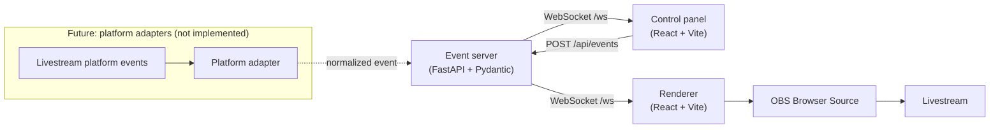

# Architecture

LiveScape is a pipeline with one narrow waist. Every event, whatever produced
it, is normalized into a versioned envelope before anything downstream sees it.

```text
event source
  → normalized LiveScape event
  → FastAPI event server
  → WebSocket
  → renderer
  → OBS Browser Source
```



## Components

### Renderer

The renderer is the product. It subscribes to the event server, re-validates
every frame it receives, and folds valid events into state with a pure reducer.
It resolves scene ids through a fixed component map and effect ids through a
fixed particle-system factory, so an id that is not in the registry cannot
reach anything that draws.

It renders no chrome by default, which is what makes it safe to point OBS at.
Diagnostics are opt-in through `?debug=1`.

### Event server

The event server validates, stamps, stores and broadcasts. That is the whole
job. It assigns `id` and `timestamp` so identity and ordering are decided in
exactly one place, keeps a small in-memory record of the current scene and
active effects, and fans each accepted envelope out to every connected client.

It never interprets a payload as code, a path, a URL or a prompt.

### Control panel

The operator UI. It is an event source like any other: it builds requests with
the shared protocol builders and POSTs them. It also subscribes to the same
WebSocket for a live activity feed, which means it sees exactly what the
renderer sees.

### Protocol package

`@livescape/protocol` holds the TypeScript types, type guards, request builders
and the canonical registry. The Python side defines the same protocol
independently with Pydantic. Both are validated against the same allowlist, and
a test fails if the two registry copies drift apart.

## Why it is shaped this way

**Local-first.** Everything binds to `127.0.0.1` and no internet connection is
required. A stream should not go dark because a remote service did.

**Platform independence.** The renderer knows nothing about any livestream
platform. An adapter's only job is to translate an external event into a
LiveScape envelope. That keeps platform churn at the edge, where it belongs.

**Resilience.** External failures must not break the renderer. When the event
server, the network or an optional integration disappears, whatever is on
screen stays on screen, and the renderer reconnects with exponential backoff
and jitter. When it reconnects, a `state.sync` envelope tells it what is
currently live instead of snapping back to the default scene.

**Explicitness.** Scene and effect ids resolve through an allowlist registry on
both sides. There is no generic "execute action" event, and payloads never
carry code. An event is a small, bounded, enumerated instruction.

**Optionality.** AI is an enhancement, never a dependency. Integrations are
optional. Core rendering must keep working with none of them configured.

## The camera boundary

Camera and video processing belong in the renderer. Camera frames never travel
over HTTP or the WebSocket: the event channel carries small control messages
only, and sending video through it would be both a privacy problem and a
latency problem.

Camera compositing is not implemented yet. When it lands, it extends the
renderer rather than the pipeline above it:

```text
Camera
    ↓
Local segmentation
    ↓
Renderer compositor
    ↑
LiveScape scene/effects
    ↓
OBS
```

See the [roadmap](roadmap.md) for what is planned, and
[Security and Privacy](security.md) for the rules this boundary enforces.
