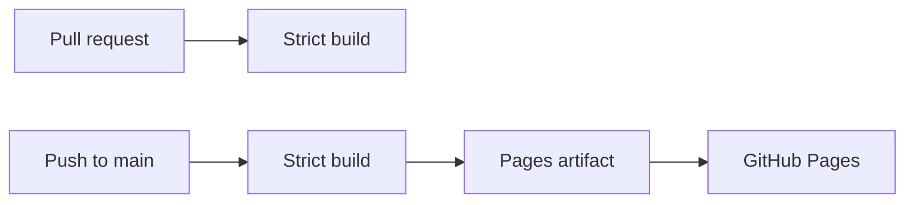

# Documentation Site

This site is built from `docs/` with MkDocs and Material for MkDocs, and is
published to GitHub Pages at
[quangshuynh.github.io/livescape](https://quangshuynh.github.io/livescape/).

## Working on it locally

From the repository root:

```bash
python -m pip install -r requirements-docs.txt
mkdocs serve
```

The site is served at <http://127.0.0.1:8000/livescape/>, under the same path
it has on GitHub Pages. `mkdocs build --strict` renders it into `site/`, which
is ignored by Git and never committed.

The build is strict: any warning fails it, including a link to a missing page
or heading, and a page left out of the navigation. Link between pages with
relative Markdown paths, such as `[OBS Setup](obs.md)`, and MkDocs rewrites
them for the published site.

## Publishing

The `Docs` workflow (`.github/workflows/docs.yml`) publishes the site. It runs
only when `docs/`, `mkdocs.yml`, `requirements-docs.txt` or the workflow itself
changes.



* **Pull requests** run the strict build and stop there. Nothing is deployed.
* **Pushes to `main`** run the same build, upload `site/` as a Pages artifact,
  and deploy it. Only the deploy job holds Pages permissions, and the
  `github-pages` environment accepts deployments from `main` only.
* **Manual runs** (`workflow_dispatch`) build any branch, and deploy only when
  run on `main`.

There is no `gh-pages` branch. GitHub builds nothing itself; it serves the
artifact the workflow uploads.

## Privacy

The site is static and has no analytics, tracking or third-party scripts.
Material's `privacy` plugin downloads the theme's web fonts and the Mermaid
diagram library at build time and serves them from the site itself, so a
visitor's browser only talks to GitHub Pages. The header's repository link also
asks the GitHub API for star and fork counts.

## Branding

The palette and header styling are in `docs/stylesheets/livescape.css`. The
header logo and favicon are small derivatives of
`docs/images/livescape-logo.png`; regenerate them from that file if the logo
changes.
