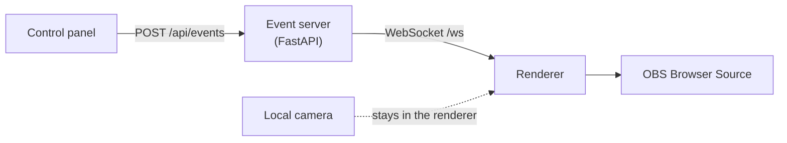

# LiveScape

Local-first interactive scene engine for livestreams. LiveScape draws a dynamic
environment around a live camera feed, reacts to events in real time, and is
designed to be dropped into OBS as a Browser Source.

Everything runs on your own machine. The event server binds to loopback, no
internet connection is needed, and camera frames never leave the renderer tab.

## How it fits together

An operator presses a button in the control panel. The event server validates
the request against an allowlist, stamps it and broadcasts it. The renderer
re-validates it and changes the scene or starts an effect. OBS shows the
renderer like any other web page.

The renderer knows nothing about any livestream platform. Future platform
adapters will translate their own events into the same protocol the control
panel already speaks; none exist yet.

## What works today

* **Four scenes** (City, Forest, Space and Roadside Workshop) and **three
  effects** (rain, snow, fireworks), drawn with CSS, SVG and Canvas and original
  to the repository. See [Scenes and Effects](scenes-and-effects.md).
* **Layered scene composition.** Scenes place artwork and seeded, autonomous
  actors on planes behind and in front of the subject. In Roadside Workshop,
  traffic passes behind you and leaves blow past in front.
* **Camera compositing** with three modes: **Off** (the default on every
  load), **Raw**, and **Segmented**, which removes your physical background with
  a segmentation model running locally. See
  [Camera and Compositing](camera.md).
* A versioned, validated [event protocol](protocol.md) and a local
  [event server](api.md) with WebSocket broadcast.
* Resilience: the renderer keeps showing the current scene when the server
  goes away, and re-syncs when it comes back.
* Reduced motion: with `prefers-reduced-motion`, scenes hold still and effects
  run lighter.

No livestream platform integration, AI, audio, persistence or authentication
exists yet. See the [Roadmap](roadmap.md).

!!! note "What has been validated"

    The camera pipeline has run with a physical camera and a real person, in
    a Chromium browser and inside an OBS Browser Source on macOS, including
    Roadside Workshop composited around the subject. The current matte
    pipeline's costs were measured with a synthetic camera; its visual quality
    on a real person has not been judged yet. The
    [camera](camera.md#verified-in-obs) and
    [scenes](scenes-and-effects.md#performance) pages record exactly what was
    measured.

## Where to start

* :material-download: **[Installation](installation.md)** sets up Node, Python
  and the workspace.
* :material-play: **[Quick Start](quick-start.md)** gets the pipeline running
  and sends the first event.
* :material-video: **[OBS Setup](obs.md)** adds the renderer as a Browser
  Source.
* :material-sitemap: **[Architecture](architecture.md)** explains the
  boundaries and why they exist.
* :material-webcam: **[Camera and Compositing](camera.md)** covers putting
  yourself inside a scene.
* :material-layers: **[Scenes and Effects](scenes-and-effects.md)** covers
  planes, actors and Roadside Workshop.

## License

MIT. See [LICENSE](https://github.com/quangshuynh/livescape/blob/main/LICENSE).
