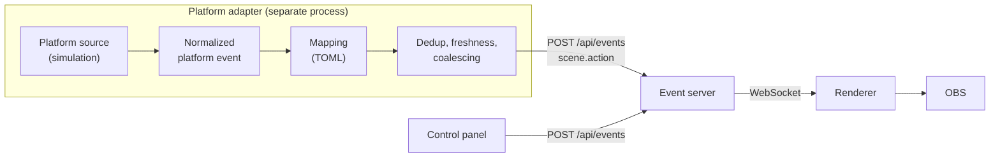

# Platform Adapters

A **platform adapter** lets an external event source, such as a livestream
platform, drive LiveScape without the renderer or the event protocol learning
anything about that platform. It is a separate local process that turns
external events into the same `scene.action` requests the control panel sends.

!!! note "What exists today"

    The adapter framework and a **simulated platform** exist. No real
    livestream platform is connected: there is no TikTok, YouTube or Twitch
    integration, and the simulator observes no real viewer. See
    [Future platform sources](#future-platform-sources).

```text
external platform (simulated today)
  → platform source            platform-specific: connection, normalization
  → normalized platform event  platform-independent, no viewer data
  → mapping                    declarative: this event selects that action
  → adapter                    dedup, freshness, coalescing, backpressure
  → POST /api/events           an ordinary scene.action
  → event server               allowlist, scene ownership, cooldown
  → WebSocket → renderer → OBS
```



The adapter has no special privileges. The event server treats its requests
exactly like the control panel's: an unknown action is a `422`, an action the
current scene does not own is a `409`, and a repeat inside the cooldown is a
`429`. The renderer re-validates and applies its own caps. What reaches the
renderer is a normal envelope whose only trace of the adapter is
`source: "simulation"`.

The adapter never imports renderer code, never sees camera frames or masks,
never connects to the renderer's WebSocket, and cannot describe new behaviour.
It can only choose among the scene actions in the registry.

## Running it

Install it next to the event server:

```bash
python -m pip install -e "services/platform-adapter"
```

Then, with the event server and renderer running (see
[Quick Start](quick-start.md)):

```bash
# Validate the mapping file and print it
python -m livescape_platform_adapter --check

# Run scenarios, print a status report and exit
python -m livescape_platform_adapter bus leaves

# Interactive: type scenario names, "gift <id> [count]", "status" or "quit"
python -m livescape_platform_adapter
```

Most bundled mappings target Roadside Workshop, so switch to that scene first
(control panel, or a `scene.change` request). Otherwise the event server refuses
the actions with `409`, which the adapter reports as a wrong-scene refusal.

| Option | Environment variable | Default |
| --- | --- | --- |
| `--server URL` | `LIVESCAPE_EVENT_SERVER_URL` | `http://127.0.0.1:8765` |
| `--mappings PATH` | `LIVESCAPE_ADAPTER_MAPPINGS` | the bundled demonstration mappings |
| `--interval-ms N` | | `0` (scenario events are a true burst) |
| `--quiet` | | print only the final status |

The server URL must be loopback (`127.0.0.1`, `::1` or `localhost`) with no
path. Any other host is refused at startup, because the event server is
unauthenticated and local-only.

## Normalized platform events

A platform source turns each platform payload into one small, platform-neutral
record, or reports it as malformed:

| Field | Meaning |
| --- | --- |
| `platform` | Short token naming the source, such as `simulation` |
| `kind` | `gift` or `follow` |
| `event_id` | The platform's own event id, when it supplies a stable one; otherwise absent |
| `gift_id` | For gifts: the platform's gift identifier, a short token |
| `quantity` | For gifts: how many, 1 to 10000 |
| `occurred_at` | When the platform says it happened, if it says; timezone aware |

Two kinds are enough to prove the boundary: one that carries an item (`gift`)
and one that does not (`follow`). Chat commands, likes and memberships can be
added when a real source needs them; nothing downstream of the mapping changes.

Normalization is strict about shape and quiet about content. Missing or
mistyped fields, unknown event kinds, gift ids that are not short tokens
(anything that looks like a path, URL or markup), out-of-range quantities and
unparseable timestamps are rejected and counted as malformed. Error messages
name the problem, never the offending value.

## Privacy and data minimization

The normalized model has **no viewer fields**. Names, handles, avatars,
biographies, email addresses, locations and every other kind of profile data
are dropped during normalization and never reach the mapping, the event
server, the renderer or the status output. Deduplication keys on the
platform's event id, so not even an opaque viewer id is carried.

The adapter keeps no viewer database, persists nothing, and sends no
analytics. Its counters live in memory and disappear when it exits. The event
ids it remembers for deduplication are platform event identifiers, held for a
bounded time and never written anywhere.

If a future visual feature genuinely needs viewer data (for example showing a
name on screen), it has to be designed explicitly, through the protocol, with
its own privacy review. The adapter does not pass it through by default.

## Mappings

A mapping file is TOML and declares exactly one thing: *this normalized event
selects that allowlisted scene action*.

```toml
version = 1

[[mapping]]
platform = "simulation"
kind = "gift"
gift = "demo.bus"
action = "roadside.send-bus"

[[mapping]]
platform = "simulation"
kind = "gift"
gift = "demo.rush"
action = "roadside.rush-hour"
min_quantity = 5

[[mapping]]
platform = "simulation"
kind = "follow"
action = "roadside.pedestrians"
```

| Key | Required | Meaning |
| --- | --- | --- |
| `platform` | yes | The source's platform token |
| `kind` | yes | `gift` or `follow` |
| `gift` | gift mappings only | The gift id to match, exactly |
| `action` | yes | A scene action id from the [registry](scene-actions.md#actions) |
| `min_quantity` | no, gift mappings only | Ignore gifts below this quantity (1 to 10000, default 1) |

That is the whole language. There are no expressions, conditions, templates,
scripts, commands, URLs, paths, prompts, HTML, CSS or actor definitions, and
any key outside the table is an **error**, not something silently ignored.

The file is validated completely at startup, and the adapter refuses to start
if anything is wrong, listing every problem at once:

* an unsupported key, at the top level or in a mapping;
* an action that is not an allowlisted scene action;
* an unsupported event kind, or a malformed platform or gift token;
* two mappings for the same event;
* a `version` other than `1`, or a file that is not valid TOML.

Actions are checked against the adapter's copy of the protocol registry, which
a test keeps identical to `packages/protocol/registry.json`, the same
arrangement the event server uses. The event server stays the authority at
runtime: if the copies ever disagreed, it would refuse the unknown action with
`422`.

A mapping selects an action; it does not guarantee one. Whether the action runs
is decided downstream by scene ownership, cooldowns, coalescing and the
renderer's caps. The mapping never says *how* an action looks; that stays in
the scene definition.

The bundled demonstration mappings (`default-mappings.toml`):

| Simulated event | Scene action |
| --- | --- |
| gift `demo.car` | `roadside.send-car` |
| gift `demo.bus` | `roadside.send-bus` |
| gift `demo.leaves` | `roadside.blow-leaves` |
| gift `demo.rush`, 5 or more | `roadside.rush-hour` |
| gift `demo.birds` | `forest.bird-flock` |
| follow | `roadside.pedestrians` |

## Deduplication

Platforms redeliver events. Webhook systems commonly promise "at least once"
delivery and retry for a long time, so the same gift can arrive more than
once. The adapter remembers each `(platform, event_id)` it has seen and
ignores a repeat.

* Memory is bounded: at most 4096 ids, oldest forgotten first.
* Ids expire after 10 minutes.
* An id is remembered on first sight, whatever happens next. A gift that was
  dropped because the server was down is still a duplicate when the platform
  retries it later, because the visual moment has passed.
* No database and no disk: a restarted adapter starts with an empty memory.

This is best-effort deduplication, not exactly-once delivery. A redelivery
after its id has expired or been evicted is not recognised. The freshness
check below usually catches those, because a late redelivery is also an old
event.

**Events without an id** cannot be deduplicated and are always treated as new.
That is the only safe choice: guessing a key from content (same gift, same
moment) would merge genuinely separate gifts. Repeated deliveries of such
events are still bounded by coalescing and by server cooldowns, but a source
for a platform without stable ids should say so in its documentation.

## Freshness

If a platform event carries an occurrence time more than **30 seconds** in the
past, it is dropped as stale. A bus arriving a minute after the gift that
caused it is not a reaction any more, and redelivery after an outage must not
replay a backlog of old moments on stream.

## Bursts and backpressure

Visual events favour the present over completeness. The adapter never queues
work in proportion to the number of incoming events:

* **Coalescing.** Each action has one pending slot. An event that maps to an
  action already pending or already being sent merges into it. Fifty gifts for
  the same bus within a moment are one request.
* **Server cooldowns.** When the event server answers `429`, the adapter holds
  that action for exactly the `retryAfterMs` the server gave (capped at 60 s)
  and drops matching events meanwhile, instead of sending requests it knows
  will be refused. Other actions are unaffected.
* **One request at a time.** A single worker sends pending actions in order.
  A pending action that could not be sent within 2 seconds is dropped.
* **No retries.** A `409`, `422` or `429` is final. A failed request is never
  resent later.

So memory is one pending slot per mapped action, one hold per action, and the
bounded deduplication memory, regardless of event rate. On the server side the
existing protections still apply: at most one broadcast per action per cooldown
window, and the renderer's own cooldowns, waiting slot and actor caps.

!!! warning "Not a ledger"

    Many gifts can produce one animation, or none: coalesced, held for
    cooldown, refused for the wrong scene, or dropped during an outage. The
    adapter's counts describe what it did visually. They are not an
    accounting of gifts, money or viewer activity, and must never be used as
    one.

## Event server failures

If the event server cannot be reached:

* the adapter keeps running and reports `server: unavailable` with the last
  error;
* the action being sent, and anything else pending, is dropped and counted;
* for the next second, matching events are dropped immediately without a
  connection attempt, so an outage costs about one attempt per second;
* after that, the next event tries again. When it succeeds the adapter reports
  that the server is reachable again, and new events work normally.

Nothing from the outage is replayed. A restarted event server comes back on
its default scene, so actions for another scene are refused with `409` until
the operator switches scenes; the adapter reports that like any other refusal.

A transport that fails in an unexpected way is counted as a server error; it
does not stop the adapter.

## Local status

The adapter prints one line per decision (mapped, duplicate, unmapped,
coalesced, held, accepted, refused, unavailable), and a JSON status report on
`status` or at the end of a scenario run:

```json
{
  "source": { "platform": "simulation", "status": "connected" },
  "server": "available",
  "counters": {
    "received": 160, "malformed": 6, "duplicates": 1, "stale": 0,
    "unmapped": 11, "belowMinimum": 0, "mapped": 142, "coalesced": 60,
    "heldForCooldown": 74, "droppedServerUnavailable": 0, "droppedExpired": 0,
    "submitted": 8, "accepted": 4, "acceptedWithoutRenderer": 0,
    "refusedWrongScene": 1, "refusedCooldown": 3, "rejectedInvalid": 0,
    "serverErrors": 0, "serverUnreachable": 0
  },
  "pending": [],
  "inFlight": null,
  "cooldownHoldsMs": { "roadside.send-bus": 3960 },
  "rememberedEventIds": 153,
  "lastResult": "forest.bird-flock: refused, forest.bird-flock belongs to forest, but the current scene is roadside-workshop",
  "lastError": null
}
```

It contains counts, action ids and gift ids only: no viewer data and no event
ids. `acceptedWithoutRenderer` counts actions the server accepted while no
renderer was connected, which usually means the OBS source or renderer tab is
not open. Nothing is persisted, and none of this appears in the OBS output.

## The simulator

The simulated platform is a real platform source with its own wire format,
deliberately different from the normalized model, so every simulated event goes
through normalization:

```json
{
  "type": "gift",
  "id": "sim-000001",
  "sentAt": "2026-09-22T20:00:00.000Z",
  "viewer": { "id": "sim-viewer-1", "name": "Simulated Viewer" },
  "gift": { "id": "demo.bus", "count": 1 }
}
```

The `viewer` block is there so the tests can prove it is dropped. Ids are
sequential (`sim-000001`, ...), so scenarios are deterministic.

| Scenario | Events |
| --- | --- |
| `car`, `bus`, `leaves`, `birds` | One gift of that kind |
| `rush` / `rush-small` | A `demo.rush` gift with count 5 / count 1 (below the minimum) |
| `follow` | One follow |
| `unknown` | A gift with no mapping |
| `duplicate` | The same bus gift delivered twice with the same id |
| `no-id` | Two leaves gifts without ids |
| `stale` | A bus gift sent five minutes ago |
| `burst` | 50 bus gifts with distinct ids |
| `mixed` | 50 gifts cycling car, bus, leaves, unknown, car |
| `malformed` | Six events that fail normalization |

Interactively, `gift <id> [count]` sends any gift id, which is handy for
trying a new mapping file.

## Future platform sources

A platform integration is a new **platform source**. It implements a small
interface (`source.py`):

```text
PlatformSource
    platform       short token matched by mappings
    event_source   the LiveScape `source` value its actions carry
    status         idle | connecting | connected | disconnected | failed
    connect()      open the platform connection
    events()       async stream of normalized events or normalization errors
    disconnect()   release it
```

The source owns everything platform-specific: credentials, connection handling,
reconnects and normalization. It never sees mappings, scene actions or the
event server. A new source sits beside the simulator; the mapping engine, the
event server, the protocol and the renderer do not change.

Constraints for any real source:

* official, documented platform APIs only; no scraping and no unofficial or
  reverse-engineered clients;
* credentials from the environment or the operator's own secret store, never
  the repository;
* bounded buffering inside the source, as the simulator does (256 raw events);
* stable event ids and occurrence times passed through where the platform has
  them;
* a platform-neutral `source` value in the protocol registry (never a
  platform's name) before it sends anything.

Which platform comes first depends on what its official APIs actually provide.
At the time of writing, TikTok's public developer documentation lists no API
that delivers real-time LIVE events such as gifts to third-party applications,
and its documented webhooks cover account and video-publishing events only.
That is recorded on the [Roadmap](roadmap.md) and will be revisited against
the platforms' current official documentation, not assumptions.
